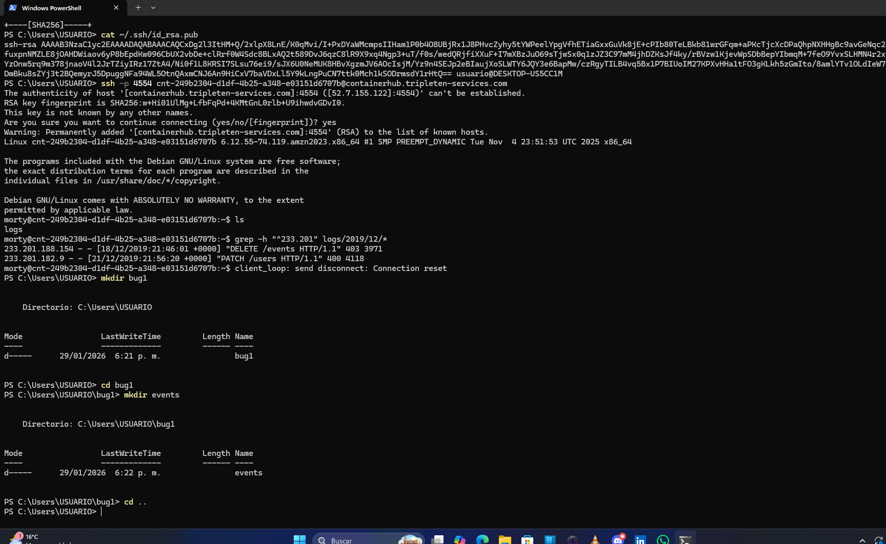
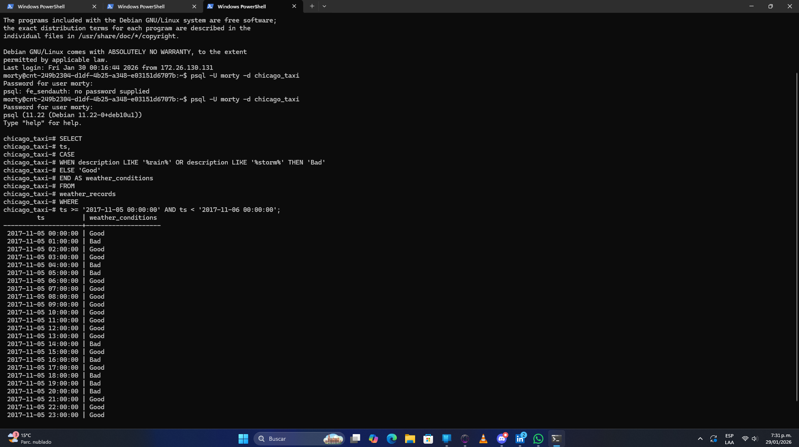
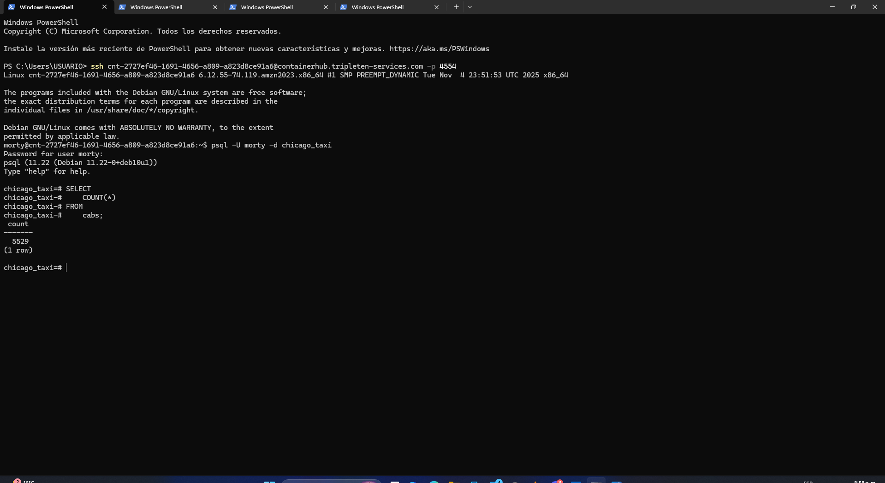

# chicago-taxi-analysis-sql
Proyecto de análisis de datos y resolución de bugs para una aplicación de taxis en Chicago. Incluye manejo de logs en servidores remotos y consultas SQL complejas para optimizar la toma de decisiones basada en clima y demanda
# 🚖 Chicago Taxi Service: SQL & Log Analysis

## 📌 Descripción del Proyecto
Este proyecto se centra en el análisis de datos para una aplicación de taxis en Chicago. El objetivo principal es extraer información estratégica sobre la flota y la demanda, además de realizar tareas de mantenimiento y depuración en servidores remotos. 

Este trabajo es parte fundamental de mi formación en el bootcamp, buscando completar el 100% de los requisitos para avanzar al **Programa de Aceleración de Carrera**.

## 🚀 Desafíos Técnicos Resueltos

### 1. Gestión de Logs en Servidor Remoto (Terminal/Bash)
Utilicé comandos de consola para investigar errores en el servidor de la aplicación:
* **Identificación de IPs:** Filtrado de solicitudes específicas utilizando patrones de IP críticos.
* **Depuración de Errores:** Creación de estructuras de directorios y archivos independientes para logs de errores 400 y 500, facilitando la revisión técnica.

### 2. Análisis de Datos con SQL
Consultas avanzadas en una base de datos PostgreSQL (`chicago_taxi`) para responder preguntas de negocio:
* **Análisis de Flota:** Identificación de compañías con menos de 100 vehículos para optimizar la oferta.
* **Lógica Condicional:** Clasificación de condiciones meteorológicas en 'Good' y 'Bad' mediante sentencias `CASE` para validar coeficientes de costo.
* **Análisis de Demanda:** Cálculo del número de viajes por compañía en fechas específicas utilizando `INNER JOIN` y funciones de agregación.

## 🛠️ Tecnologías Utilizadas
* **Lenguaje:** SQL (PostgreSQL)
* **Herramientas de Servidor:** Bash, SSH, Grep
* **Plataforma:** GitHub para control de versiones y portafolio profesional

## 📈 Insights Clave
* Se logró correlacionar el impacto del clima con la cantidad de viajes realizados.
* Se detectaron discrepancias entre los reportes de ganancias y el volumen real de viajes de las compañías de taxis.

---
## 💡 Sobre mi proceso
Este repositorio refleja mi compromiso con la mejora continua. Tras un cambio radical en mi enfoque profesional, hoy dedico mi energía al 100% al desarrollo técnico y análisis de datos, aplicando la resiliencia y disciplina adquiridas en experiencias previas.

---
📫 **Contacto:**
* www.linkedin.com/in/edwin-albeiro-sanchez-blanco-975530176
* https://github.com/edwinsanchez910
* ---
## 📸 Evidencias del Proyecto

### 1. Gestión de Logs y Directorios
En esta captura se observa la creación de la estructura de carpetas `bug1/events` y el filtrado de errores 400 y 500 directamente desde el servidor.
 

### 2. Consultas en PostgreSQL
Aquí se muestra la ejecución exitosa de las consultas SQL, incluyendo el análisis de la flota de taxis y la clasificación climática.

### 3. Conexión SSH Exitosa
Evidencia de la conexión segura al servidor remoto de TripleTen con el usuario **morty**.

